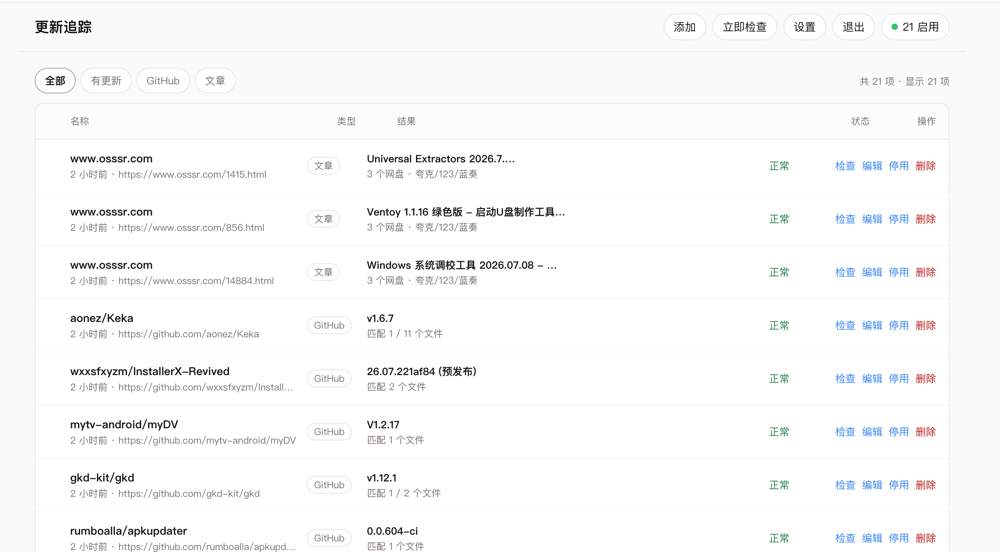

# 更新追踪（AppUpdate）

内网自用：追踪 **GitHub Release 下载附件**、**单篇文章网盘链接**，以及 **网盘分享页本身的更新**，网页管理，可选 Telegram 推送（简洁/详细）。



## 功能

- **GitHub 公开仓库**：正式版 + 预发布；按扩展名 / 系统 / 架构别名 / 包含·排除筛选附件
- **单篇文章**：标题变化则整页重抓，提取百度 / 阿里 / 夸克 / 123 / 天翼 / 蓝奏（链接、提取码、标题备注）
- **网盘分享**：直接添加分享链接（可选提取码），监控分享内文件列表变化；支持百度 / 阿里 / 夸克 / 123 / 天翼 / 蓝奏；展示探测模式（文件列表 / 页面指纹）
- **添加识别**：粘贴链接自动识别 GitHub / 文章 / 网盘，网盘提取码可从 URL 预填
- 只保留当前最新状态（有变化才推送；首次检查不刷屏）
- 固定间隔检查（默认 6 小时，可在设置里改）+ 立即检查 / 检查失败项 / 勾选批量检查
- 列表多选：批量启用、停用、删除
- 可停用不删除
- 可选面板访问密码
- 详情按需展开：点某一行在该行下方展开，再点同一行或 × / Esc 收起（不在列表底部）
- Docker 一键部署

## 上线部署（推荐）

### 方式 A：拉取公开镜像（最快）

镜像已公开，无需登录即可拉取：

```bash
mkdir -p data
docker run -d --name appupdate \
  -p 8000:8000 \
  -v "$PWD/data:/data" \
  --restart unless-stopped \
  ghcr.io/fatelightx/appupdate:latest
```

或使用 compose，编辑 `docker-compose.yml`：注释 `build`，取消注释 `image`，然后：

```bash
docker compose up -d
```

### 方式 B：本地构建

```bash
# 若使用 Colima（无 Docker Desktop 时）
# brew install colima docker docker-compose && colima start

docker compose up -d --build
```

浏览器打开：http://127.0.0.1:8000

首次打开为空列表。在网页中：

1. **设置**：检查间隔、Telegram Bot Token / Chat ID（可选）、**面板访问密码（可选）**
2. **添加**：GitHub 仓库、文章链接或网盘分享链接，并配置筛选/提取码
3. 添加后会自动检查；也可随时点 **立即检查** 或单项 **检查**

数据目录：`./data`（SQLite：`appupdate.db`，首次运行自动创建）

停止：

```bash
docker compose down
# 或
docker rm -f appupdate
```

## GitHub Actions 镜像

推送到 `main` 或打 `v*` 标签后，会自动构建并推送多架构镜像到 GHCR：

| 标签 | 说明 |
|------|------|
| `ghcr.io/fatelightx/appupdate:latest` | `main` 最新 |
| `ghcr.io/fatelightx/appupdate:main` | 同 main |
| `ghcr.io/fatelightx/appupdate:sha-<短提交>` | 按提交 |
| `ghcr.io/fatelightx/appupdate:1.0.0` | 标签 `v1.0.0` |

工作流：`.github/workflows/docker.yml`  
也可在 GitHub → Actions → **Docker Image** → **Run workflow** 手动触发。

包页面：https://github.com/users/FateLightX/packages/container/package/appupdate

## 可选环境变量

| 变量 | 说明 |
|------|------|
| `GITHUB_TOKEN` | 提高 GitHub API 限额（建议服务器配置） |
| `APPUPDATE_PANEL_PASSWORD` | 首次初始化时写入面板密码（库中已有密码时不覆盖；日常请在网页设置） |
| `APPUPDATE_DATA_DIR` | 数据目录，默认 `/data`（容器内） |
| `APPUPDATE_INTERVAL_HOURS` | 仅影响**首次初始化**时的默认间隔，之后以网页设置为准 |

在 `docker-compose.yml` 中取消对应注释即可注入。

## 本地开发

需要 Python 3.12 或 3.13：

```bash
python3 -m venv .venv
source .venv/bin/activate
pip install -r requirements.txt
uvicorn app.main:app --reload --host 0.0.0.0 --port 8000
```

## 说明

- 仅支持公开 GitHub 仓库
- 网盘监控只读分享信息，不做自动下载、不自动转存；部分盘商有登录墙/验证码时退化为页面指纹监控
- 默认无密码；可在设置中开启面板密码
- 设计稿与交互原型在 `design-options/`、`prototype/`，部署不需要，已排除在 Docker 构建之外

## 界面要点

- 列表展示名称、类型、结果摘要、状态与操作；结果 / 状态 / 操作列有最小宽度，避免被挤扁
- 点击某一行，在**该行下方**展开详情（下载链接 / 网盘与提取码），不在列表最底部
- 再点同一行、点 × 或按 Esc 可收起
- 设置可随时改检查间隔、Telegram（推送简洁/详细）、面板密码
